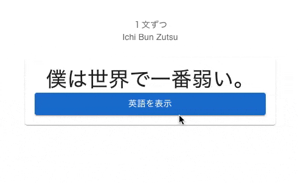

# Ichi Bun Zutsu
A web app for Japanese reading practice by presenting a Japanese sentence every day.



I started this project as a "rehab" project for getting back into programming. While the main goal is to learn NextJS and TypeScript, the web app is something that's relevant to my current "endeavour", which is learning the Japanese language.

## Useful Links
- [GitHub Repository](https://github.com/enreina/ichibunzutsu)
- [Figma Design](https://www.figma.com/file/13XJUSltNujMuN8H8Rq6h4/Ichi-Bun-Zutsu?node-id=2%3A3)
- [Notion Notes](https://www.notion.so/Pet-Project-Ichi-Bun-Zutsu-49a98f061b4a4a698fa351a3034845ca)

## Setup Environment Variables
Copy `.env.sample` to `.env.local`
```bash
cp .env.sample .env.local
```
If you want to be able to use the app without a WaniKani account, you'd need to setup a Google Sheet for fetching the sentence:
1. Make a copy of this Google Sheet spreadsheet: https://docs.google.com/spreadsheets/d/1Ejvindpn_eqY3tZHbFxjHeqlyNdiaJP-XOjZ89JA1EE/edit?usp=sharing
2. Sign up a https://sheetson.com account (login with your gmail account)
3. Share your copy of the spreadsheet to google@sheetson.com
4. Get the spreadsheet id as described in: https://docs.sheetson.com/getting-started/#getting-spreadsheet-id-and-sheet-name. Set the `SHEETSON_SPREADHEET_ID` in `.env.local` with this spreadsheet id.
5. Get your Sheetson API Key from https://sheetson.com/console, and set it as value of the `SHEETSON_API_KEY` variable on your `.env.local`

Note that the sentences from the sample spreadsheet are downloaded from [Tatoeba](https://tatoeba.org).

## Download dictionary files
To enable furigana feature, the app depends on [kuroshiro](https://github.com/hexenq/kuroshiro) and [kuromoji](https://github.com/takuyaa/kuromoji.js) which uses these [dictionary files](https://github.com/takuyaa/kuromoji.js/tree/master/dict).
Download the dictionary files to your machine with the donwload dictionary script:
```
./download-dictionary.sh
```
The files should be downloaded to the `/dict` dictionary or the project root.

## Running the Web App Locally
Run the web server:
```
yarn dev
```
Open http://localhost:3000 with your browser. When the app is opened for the first time, a settings dialog would be presented to enable or disable WaniKani integration. If WaniKani fetching is enabled, you'll be asked to input your WaniKani API Key. Input your API Key, and after the page loads, you should see a Japanese sentence on the screen. 

### Why do I need to input a WaniKani API key?
If WaniKani fetching is enabled, the sentence would be fetched from WaniKani API through the `/v2/subjects` endpoint (see [WaniKani API Reference](https://docs.api.wanikani.com/20170710/#get-all-subjects) for more details). You need to sign up on [WaniKani](https://wanikani.com/) to get the API Key. Free account works as well as the app currently only fetches sentences from the first 3 levels (which are free). Once you are signed in to WaniKani, you can get the token [here](https://www.wanikani.com/settings/personal_access_tokens).

## Setting up Prisma
The web app is being migrated to use Prisma & Postgres database as sentence source. For development, set the database url & shadow url in your `.env.local` (see `.env.sample`). Then run the following command when synching the Prisma schema with the database:
`yarn dotenv -e .env.local prisma migrate dev`
To generate the prisma client run:
`yarn prisma generate`

-----

This is a [Next.js](https://nextjs.org/) project bootstrapped with [`create-next-app`](https://github.com/vercel/next.js/tree/canary/packages/create-next-app).

## Getting Started

First, run the development server:

```bash
npm run dev
# or
yarn dev
```

Open [http://localhost:3000](http://localhost:3000) with your browser to see the result.

You can start editing the page by modifying `pages/index.tsx`. The page auto-updates as you edit the file.

[API routes](https://nextjs.org/docs/api-routes/introduction) can be accessed on [http://localhost:3000/api/hello](http://localhost:3000/api/hello). This endpoint can be edited in `pages/api/hello.ts`.

The `pages/api` directory is mapped to `/api/*`. Files in this directory are treated as [API routes](https://nextjs.org/docs/api-routes/introduction) instead of React pages.

## Learn More

To learn more about Next.js, take a look at the following resources:

- [Next.js Documentation](https://nextjs.org/docs) - learn about Next.js features and API.
- [Learn Next.js](https://nextjs.org/learn) - an interactive Next.js tutorial.

You can check out [the Next.js GitHub repository](https://github.com/vercel/next.js/) - your feedback and contributions are welcome!

## Deploy on Vercel

The easiest way to deploy your Next.js app is to use the [Vercel Platform](https://vercel.com/new?utm_medium=default-template&filter=next.js&utm_source=create-next-app&utm_campaign=create-next-app-readme) from the creators of Next.js.

Check out our [Next.js deployment documentation](https://nextjs.org/docs/deployment) for more details.
