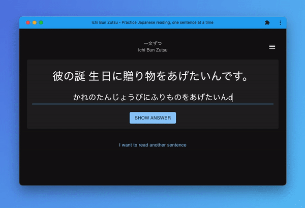

# Ichi Bun Zutsu
A web app for Japanese reading practice by presenting a Japanese sentence every day.



I started this project as a "rehab" project for getting back into programming. While the main goal is to learn NextJS and TypeScript, the web app is something that's relevant to my current "endeavour", which is learning the Japanese language.

## Useful Links
- [GitHub Repository](https://github.com/enreina/ichibunzutsu)
- [Figma Design](https://www.figma.com/file/13XJUSltNujMuN8H8Rq6h4/Ichi-Bun-Zutsu?node-id=2%3A3)
- [Notion Notes](https://www.notion.so/Pet-Project-Ichi-Bun-Zutsu-49a98f061b4a4a698fa351a3034845ca)

## Running the Web App Locally
The sentence is currently being fetched from WaniKani API through the `/v2/subjects` endpoint (see [WaniKani API Reference](https://docs.api.wanikani.com/20170710/#get-all-subjects) for more details). You need to sign up on [WaniKani](https://wanikani.com/) to get the API Token. Free account works as well as the app currently only fetches sentences from the first 3 levels (which are free). Once signed in to WaniKani, you can get the token [here](https://www.wanikani.com/settings/personal_access_tokens).

Then, create an `.env.local` in the root directory and fill in your API Token:
```
NEXT_PUBLIC_WANIKANI_API_KEY=<FILL IN YOUR WANIKANI API TOKEN>
```
Then, run the Web App:
```
yarn dev
```
Open http://localhost:3000 with your browser, and you'll be asked to input your WaniKani API Key. Input your API Key, and after the page loads, you should see a Japanese sentence on the screen.

### Why do I need to input a WaniKani API key?
The sentence is currently being fetched from WaniKani API through the `/v2/subjects` endpoint (see [WaniKani API Reference](https://docs.api.wanikani.com/20170710/#get-all-subjects) for more details). You need to sign up on [WaniKani](https://wanikani.com/) to get the API Key. Free account works as well as the app currently only fetches sentences from the first 3 levels (which are free). Once you are signed in to WaniKani, you can get the token [here](https://www.wanikani.com/settings/personal_access_tokens).

-----

This is a [Next.js](https://nextjs.org/) project bootstrapped with [`create-next-app`](https://github.com/vercel/next.js/tree/canary/packages/create-next-app).

## Getting Started

First, run the development server:

```bash
npm run dev
# or
yarn dev
```

Open [http://localhost:3000](http://localhost:3000) with your browser to see the result.

You can start editing the page by modifying `pages/index.tsx`. The page auto-updates as you edit the file.

[API routes](https://nextjs.org/docs/api-routes/introduction) can be accessed on [http://localhost:3000/api/hello](http://localhost:3000/api/hello). This endpoint can be edited in `pages/api/hello.ts`.

The `pages/api` directory is mapped to `/api/*`. Files in this directory are treated as [API routes](https://nextjs.org/docs/api-routes/introduction) instead of React pages.

## Learn More

To learn more about Next.js, take a look at the following resources:

- [Next.js Documentation](https://nextjs.org/docs) - learn about Next.js features and API.
- [Learn Next.js](https://nextjs.org/learn) - an interactive Next.js tutorial.

You can check out [the Next.js GitHub repository](https://github.com/vercel/next.js/) - your feedback and contributions are welcome!

## Deploy on Vercel

The easiest way to deploy your Next.js app is to use the [Vercel Platform](https://vercel.com/new?utm_medium=default-template&filter=next.js&utm_source=create-next-app&utm_campaign=create-next-app-readme) from the creators of Next.js.

Check out our [Next.js deployment documentation](https://nextjs.org/docs/deployment) for more details.
